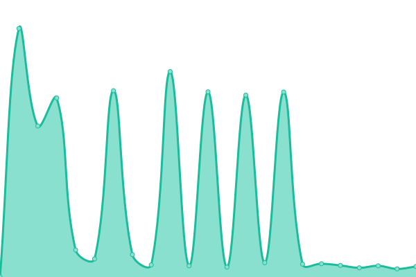
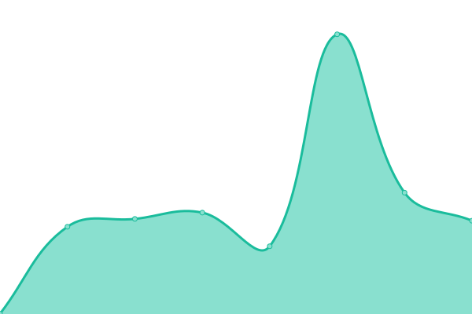

# [📈 Live Status](https://status.firenze.digital): <!--live status--> **🟧 Partial outage**

This repository contains the open-source uptime monitor and status page for [FirenzeDigital](https://status.firenze.digital), powered by [Upptime](https://github.com/upptime/upptime).

With [Upptime](https://upptime.js.org), you can get your own unlimited and free uptime monitor and status page, powered entirely by a GitHub repository. We use [Issues](https://github.com/FirenzeDigital/upptime/issues) as incident reports, [Actions](https://github.com/FirenzeDigital/upptime/actions) as uptime monitors, and [Pages](https://status.firenze.digital) for the status page.

<!--start: status pages-->
<!-- This summary is generated by Upptime (https://github.com/upptime/upptime) -->
<!-- Do not edit this manually, your changes will be overwritten -->
<!-- prettier-ignore -->
| URL | Status | History | Response Time | Uptime |
| --- | ------ | ------- | ------------- | ------ |
|  [Firenze Digital Website](https://firenze.digital) | 🟩 Up | [firenze-digital-website.yml](https://github.com/FirenzeDigital/upptime/commits/HEAD/history/firenze-digital-website.yml) | 

 128ms
     
 | 

<a href="https://status.firenze.digital/history/firenze-digital-website">100.00%</a>
    

|  [Liga Ardyti](https://ligaardyti.com.ar) | 🟥 Down | [liga-ardyti.yml](https://github.com/FirenzeDigital/upptime/commits/HEAD/history/liga-ardyti.yml) | 

 539ms
     
 | 

<a href="https://status.firenze.digital/history/liga-ardyti">86.52%</a>
    

|  [Andrisani Website](https://www.andrisani.com.ar) | 🟩 Up | [andrisani-website.yml](https://github.com/FirenzeDigital/upptime/commits/HEAD/history/andrisani-website.yml) | 

 814ms
     
 | 

<a href="https://status.firenze.digital/history/andrisani-website">98.48%</a>
    

|  [Andrisani Socios Admin](https://socios.andrisani.com.ar) | 🟩 Up | [andrisani-socios-admin.yml](https://github.com/FirenzeDigital/upptime/commits/HEAD/history/andrisani-socios-admin.yml) | 

 1542ms
     
 | 

<a href="https://status.firenze.digital/history/andrisani-socios-admin">100.00%</a>
    

<!--end: status pages-->

[**Visit our status website →**](https://status.firenze.digital)

## 📄 License

- Powered by: [Upptime](https://github.com/upptime/upptime)
- Code: [MIT](./LICENSE) © [FirenzeDigital](https://status.firenze.digital)
- Data in the `./history` directory: [Open Database License](https://opendatacommons.org/licenses/odbl/1-0/)
